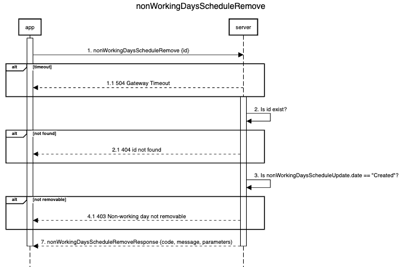

# Implement non-working scheduling

* [Business Value](#1)
* [Description](#2)
* [To do](#3)
  * [Create a non-working plan entity](#3.1)
  * [Implement a method for creating a scheduled non-working day](#3.2)
  * [Implement a method for getting a scheduled non-working days](#3.3)
  * [Implement a method for updating a scheduled non-working day](#3.4)
  * [Implement a method for removing a scheduled non-working day](#3.5)
  * [Implement nonWorkingDaysScheduler](#3.6)
  * [Logging](#3.7)
* [AT](#4)


<h2 id="1"> Business Value</h2>
  Providing the possibility of planning non-working days for trading instruments

<h2 id="2"> Description</h2>
  We create the entity "plan of non-working days" and methods of interaction with it. This will allow users to plan non-working days for trading instruments and will not affect processes that are in commercial operation.

<h2 id="3">To do</h2>

<h3 id="3.1">Create a non-working plan entity</h3>

#### nonWorkingDaysSchedule

| Parameter                | Description                                                                                                                      | Data type                           | Uniqueness | Required |
|:-------------------------|:---------------------------------------------------------------------------------------------------------------------------------|:------------------------------------|:-----------|:-|
| id                       | Unique identifier of the non-working day                                                                                         | At the executor dicretion           | +          | + |
| objectSymbolId           | Trading instrument ID                                                                                                            | Identical to current implementation | -          | + |
| startNonWorkingDayDate   | Date of non-working day in UTC+0 timezone (yyyy-mm-dd hh:mm:ss)                                                                  | Date with timestamp                 | -          | + |
| endNonWorkingDayDate     | startNonWorkingDayDate + 24h (yyyy-mm-dd hh:mm:ss)                                                                               | Date with timestamp                 | -          | - |
| status                   | Non-working status (created, planned, in progress, done)                                                                         | String                              | -          | + |
| updateSymbolIntervalDate | Date and time of objectInterval update                                                                                           | Date with timestamp                 | -          | - |
| startSecond              | Amount of seconds from the beginning of Sunday 00:00:00. Determines start of turning Symbol on of non-working day                | int                                 | -          | - |
| endSecond                | Amount of seconds from the beginning of Sunday 00:00:00. Determines time of turning Symbol off of non-working day                | int                                 | -          | - |
| startSecondBase          | Amount of seconds from the beginning of Sunday 00:00:00. Determines start of turning Symbol on of objectSymbolId.objectInterval  | int                                 | -          | - |
| endSecondBase            | Amount of seconds from the beginning of Sunday 00:00:00. Determines start of turning Symbol off of objectSymbolId.objectInterval | int                                 | -          | - |
| isItInWorkingDays        | Logical definition of finding a non-working day in the work schedule                                                             | Boolean                             | -          | - |

<h3 id="3.2">Implement a method for creating a scheduled non-working day</h3>

#### nonWorkingDaysScheduleCreate


**Parameters**

| Name           | Description                            | Required |
|:---------------|:---------------------------------------|:---------|
| objectSymbolId | Trading instrument ID                  | +        |
| date           | Date with timestamp of non-working day | +        |

**Validation**

1. Are all required parameters present in the request?
  1. Yes - go to 2
  2. No - Validation failed - sending code 400
2. Is the specified symbol found in the objectSymbol?
  1. Yes - go to 3
  2. No - Validation failed - sending code 404
3. Is the date correct?
  1. Yes - go to 4
  2. No - Validation failed - sending code 400
4. Is nonWorkingDaysScheduleCreate.date < now?
  1. No - go to 5
  2. Yes - Validation failed - sending code 406
5. Is created this non-working day?
  1. No - go to 6
  2. Yes - Validation failed - sending code 409
6. Validation passed

**Responses**

| Code | Message            | Parameters                                       |
|:-----|:-------------------|:-------------------------------------------------|
| 201  | Success            | ```{nonWorkingDaysSchedule.id, nonWorkingDaysSchedule.startNonWorkingDayDate, nonWorkingDaysSchedule.endNonWorkingDayDate, nonWorkingDaysSchedule.status}``` |
| 504  | Gateway Timeout    |                                                  |
| 404  | Symbol not found   |                                                  |
| 400  | Miss parameters    |                                                  |
| 400  | Incorrect date     |                                                  |
| 406  | Date not available |                                                  |
| 409  | Exist              |                                                  |

#### Saving of a created non-working day

| Parameter                | Assigned value                                    |
|:-------------------------|:--------------------------------------------------|
| id                       | New unique identifier value                       |
| objectSymbolId           | = nonWorkingDaysScheduleCreate.objectSymbolId     |
| startNonWorkingDayDate   | = nonWorkingDaysScheduleCreate.date               |
| endNonWorkingDayDate     | = nonWorkingDaysScheduleCreate.date + 24h         |
| status                   | = "Created"                                       |
| updateSymbolIntervalDate | = nearest past Sunday 00:00:00 in relation to nonWorkingDaysScheduleCreate.date |
| startSecond              | = nonWorkingDaysSchedule.endSecond + 86400        |
| endSecond                | = seconds(startNonWorkingDayDate - updateSymbolIntervalDate) |
| startSecondBase          | null                                              |
| endSecondBase            | null                                              |
| isItInWorkingDays        | null                                              |

<h3 id="3.3">Implement a method for getting a scheduled non-working days</h3>

#### nonWorkingDaysScheduleGet


**Parameters**

| Name           | Description                                              | Required |
|:---------------|:---------------------------------------------------------|:-|
| objectSymbolId | Trading instrument ID                                    | + |
| status         | Non-working status (created, planned, in progress, done) | - |

**Validation**

1. Are all required parameters present in the request?
  1. Yes - go to 2
  2. No - Validation failed - sending code 400
2. Is the specified symbol found in the objectSymbol?
  1. Yes - go to 3
  2. No - Validation failed - sending code 404
3. Is the status correct?
  1. Yes - go to 4
  2. No - Validation failed - sending code 400
4. Validation passed

**Responses**

| Code | Message          | Parameters                                         |
|:-----|:-----------------|:---------------------------------------------------|
| 200  | Success          | ```{nonWorkingDaysSchedule.objectSymbolId[{nonWorkingDaysSchedule.id, nonWorkingDaysSchedule.startNonWorkingDayDate, nonWorkingDaysSchedule.endNonWorkingDayDate, nonWorkingDaysSchedule.status} ... {nonWorkingDaysSchedule.id, nonWorkingDaysSchedule.startNonWorkingDayDate, nonWorkingDaysSchedule.endNonWorkingDayDate, nonWorkingDaysSchedule.status}]}``` |
| 504  | Gateway Timeout  |                                                    |
| 404  | Symbol not found |                                                    |
| 400  | Miss parameters  |                                                    |
| 400  | Incorrect status |                                                    |


<h3 id="3.4">Implement a method for updating a scheduled non-working day</h3>

#### nonWorkingDaysScheduleUpdate


**Parameters**

| Name | Description                              | Required |
|:-----|:-----------------------------------------|:---------|
| id   | Unique identifier of the non-working day | +        |
| date | Date with timestamp of non-working day   | +        |

**Validation**

1. Are all required parameters present in the request?
  1. Yes - go to 2
  2. No - Validation failed - sending code 400
2. Is id exist?
  1. Yes - go to 3
  2. No - Validation failed - sending code 404
3. Is the date correct?
  1. Yes - go to 4
  2. No - Validation failed - sending code 400
4. Is nonWorkingDaysScheduleUpdate.date < now?
  1. No - go to 5
  2. Yes - Validation failed - sending code 406
5. Is nonWorkingDaysScheduleUpdate.status == "Created"?
  1. Yes - go to 6.
  2. No - Validation failed - sending code 403
6. Validation passed

**Responses**

| Code | Message                       | Parameters                            |
|:-----|:------------------------------|:--------------------------------------|
| 200  | Success                       | ```{nonWorkingDaysSchedule.id, nonWorkingDaysSchedule.startNonWorkingDayDate, nonWorkingDaysSchedule.endNonWorkingDayDate, nonWorkingDaysSchedule.status}``` |
| 504  | Gateway Timeout               |                                       |
| 404  | id not found                  |                                       |
| 400  | Miss parameters               |                                       |
| 400  | Incorrect date                |                                       |
| 406  | Date not available            |                                       |
| 403  | Non-working day not updatable |                                       |

#### Saving changes of a updated non-working day

| Parameter                | Assigned value                                    |
|:-------------------------|:--------------------------------------------------|
| id                       | does not change                                   |
| objectSymbolId           | does not change                                   |
| startNonWorkingDayDate   | = nonWorkingDaysScheduleUpdate.date               |
| endNonWorkingDayDate     | = nonWorkingDaysScheduleUpdate.date + 24h         |
| status                   | does not change                                   |
| updateSymbolIntervalDate | = nearest past Sunday 00:00:00 in relation to nonWorkingDaysScheduleCreate.date |
| startSecond              | = nonWorkingDaysSchedule.endSecond + 86400        |
| endSecond                | = seconds(startNonWorkingDayDate - updateSymbolIntervalDate) |
| startSecondBase          | does not change                                   |
| endSecondBase            | does not change                                   |
| isItInWorkingDays        | does not change                                   |

<h3 id="3.5">Implement a method for removing a scheduled non-working day</h3>

#### nonWorkingDaysScheduleRemove



**Parameters**

| Name | Description                              | Required |
|:-----|:-----------------------------------------|:---------|
| id   | Unique identifier of the non-working day | +        |

**Validation**

1. Is id exist?
  1. Yes - go to 2
  2. No - Validation failed - sending code 404
2. Is nonWorkingDaysScheduleUpdate.date == "Created"?
  1. Yes - go to 3.
  2. No - Validation failed - sending code 403
3. Validation passed


**Responses**

| Code | Message                       | Parameters                  |
|:-----|:------------------------------|:----------------------------|
| 200  | Success                       | {nonWorkingDaysSchedule.id} |
| 504  | Gateway Timeout               |                             |
| 404  | id not found                  |                             |
| 403  | Non-working day not removable |                             |

Delete record with the id == nonWorkingDaysScheduleRemove.id

<h3 id="3.6">Implement nonWorkingDaysScheduler</h3>

The scheduler is a cyclic entity that works according to the scenario described below.

1. Scheduler constantly checks if nonWorkingDaysSchedule.updateSymbolIntervalDate == now() of records where nonWorkingDaysSchedule.status != "Done".

  1. When equality is found, and nonWorkingDaysSchedule.status = "Created" the process from step 2 is started.
  2. When equality is found, and nonWorkingDaysSchedule.status = "Planned" the process from step 6 is started.
  3. When equality is found, and nonWorkingDaysSchedule.status = "In progress" the process from step 9 is started.


2. Scheduler requests values of objectSymbolId.objectInterval.startSecond and objectSymbolId.objectInterval.endSecond and updates of the following parameters accordingly:
```
nonWorkingDaysSchedule.startSecondBase = objectInterval.startSecond
nonWorkingDaysSchedule.endSecondBase = objectInterval.endSecond
```


3. Scheduler compares values of the following parameters:

  1. If nonWorkingDaysSchedule.endSecondBase >= nonWorkingDaysSchedule.endSecond

    1. Scheduler updates the value of the following parameters:
    ```
    nonWorkingDaysSchedule.isItInWorkingDays = false
    ```

    2. Go to 4.

  2. If nonWorkingDaysSchedule.endSecondBase < nonWorkingDaysSchedule.endSecond

  1. Scheduler updates the value of the following parameters:
    ```
    nonWorkingDaysSchedule.isItInWorkingDays = true
    ```

  2. Go to 5.


4. Scheduler
  1. Updates the value of the following parameters:
  ```
  nonWorkingDaysSchedule.status = "planned"
  nonWorkingDaysSchedule.updateSymbolIntervalDate = nonWorkingDaysSchedule.startNonWorkingDayDate
  ```

  2. Go to 1.


5. Scheduler:

  1. Initiates a value change of objectSymbolId.objectInterval.endSecond
  ```
  objectSymbolId.objectInterval.endSecond == nonWorkingDaysSchedule.endSecond
  ```

  2. Updates the value of the following parameters:
  ```
  nonWorkingDaysSchedule.updateSymbolIntervalDate = nonWorkingDaysSchedule.startNonWorkingDayDate
  nonWorkingDaysSchedule.status = "planned"
  ```

  3. Initiates SymbolChangedEvent(objectSymbolId, CUDOperation.UPDATE) send
  4. Go to 1.


6. Scheduler checks nonWorkingDaysSchedule.isItInWorkingDays value
  1. If nonWorkingDaysSchedule.isItInWorkingDays == false then go to 7
  2. If nonWorkingDaysSchedule.isItInWorkingDays == true then go to 8


7. Scheduler
  1. Updates the value of the following parameters:
  ```
  nonWorkingDaysSchedule.status = "In progress"
  onWorkingDaysSchedule.updateSymbolIntervalDate = nonWorkingDaysSchedule.endNonWorkingDayDate
  ```

  2. Go to 1.


8.  Scheduler:
  1. Initiates a value change of objectSymbolId.objectInterval.endSecond
  ```
  objectSymbolId.objectInterval.startSecond = nonWorkingDaysSchedule.startSecond
  objectSymbolId.objectInterval.endSecond = nonWorkingDaysSchedule.endSecondBase
  ```

  2. Updates the value of the following parameters:
  ```
  nonWorkingDaysSchedule.status = "In progress"
  nonWorkingDaysSchedule.updateSymbolIntervalDate = nonWorkingDaysSchedule.endNonWorkingDayDate
  ```

  3. Initiates SymbolChangedEvent(objectSymbolId, CUDOperation.UPDATE) send
  4. Go to 1.


9. Scheduler checks nonWorkingDaysSchedule.isItInWorkingDays value
  1. If nonWorkingDaysSchedule.isItInWorkingDays == false then go to 10
  2. If nonWorkingDaysSchedule.isItInWorkingDays == true then go to 11


10. Scheduler
  1. Updates the value of the following parameters:
  ```
  nonWorkingDaysSchedule.status = "Done"
  ```

  2. Go to 1.


11. Scheduler
  1. Initiates a value change of objectSymbolId.objectInterval.endSecond
  ```
  objectSymbolId.objectInterval.startSecond = nonWorkingDaysSchedule.startSecondBase
  ```

  2. Updates the value of the following parameters:
  ```
  nonWorkingDaysSchedule.status = "Done"
  ```

  3. Initiates SymbolChangedEvent(objectSymbolId, CUDOperation.UPDATE) send
  4. Go to 1.

<h3 id="3.7">Logging</h3>

It is necessary to log all actions performed - both internal processes and external interaction with the scheduler entity.

#### Log Format

```
datetime, type, action{parameters}
```

| Paramter   | Description                                 |
|:-----------|:--------------------------------------------|
| datetime   | timestamp of event                          |
| type       | Type of event - can be internal or external |
| action     | Action performed within the entity          |
| parameters | Data included in the event                  |

<h2 id="4">AT</h2>

Here is full size table - [AT](https://egorzotkin.com/AT.html)

<table>
 <tr>
  <th>Role</th>
  <th>Action</th>
  <th>Result</th>
 </tr>
 <tr>
 <td colspan =3>nonWorkingDaysScheduleCreate</td>
 </tr>
 <tr>
  <td>External App</td>
  <td>Sends nonWorkingDaysScheduleCreate{%some_correct_objectSymbolId%, %some_correct_date>=now()%}  </td>
  <td> Success<br>
  1. nonWorkingDaysScheduleCreate.Validation passed<br>
  2. A record was created in nonWorkingDaysSchedule according to the passed parameters<br>
  3. Server responded with the following parameters{"201", "Success","{nonWorkingDaysSchedule.id, nonWorkingDaysSchedule.startNonWorkingDayDate, nonWorkingDaysSchedule.endNonWorkingDayDate, nonWorkingDaysSchedule.status}"}<br>
  4. A log entry was created according to the passed parameters </td>
 </tr>
 <tr>
  <td>External App</td>
  <td>Sends nonWorkingDaysScheduleCreate</td>
  <td>Error<br>
  1. Server responded to the request with the following parameters {"400", "Miss parameters"}<br>
  2. A log entry was created according to the passed parameters</td>
 </tr>
 <tr>
  <td>External App</td>
  <td>Sends nonWorkingDaysScheduleCreate{%some_uncorrect_objectSymbolId%, %some_date>now()%}</td>
  <td>Error<br>
  1. Server responded to the request with the following parameters {"404", "Symbol not found"}<br>
  2. A log entry was created according to the passed parameters</td>
 </tr>
 <tr>
  <td>External App</td>
  <td>Sends nonWorkingDaysScheduleCreate{%some_correct_objectSymbolId%, %some_uncorrect_date%}</td>
  <td>Error<br>
  1. Server responded to the request with the following parameters {"400", "Incorrect date"}<br>
  2. A log entry was created according to the passed parameters</td>
 </tr>
 <tr>
  <td>External App</td>
  <td>Sends nonWorkingDaysScheduleCreate{%some_correct_objectSymbolId%, %some_date<now()%}</td>
  <td>Error<br>
  1. Server responded to the request with the following parameters {"406", "Date not available"}<br>
  2. A log entry was created according to the passed parameters</td>
 </tr>
 <tr>
  <td>External App</td>
  <td>Sends nonWorkingDaysScheduleCreate{%some_correct_objectSymbolId%, %some_exist_date>=now()%}</td>
  <td>Error<br>
  1. Server responded to the request with the following parameters {"409", "Exist"}<br>
  2. A log entry was created according to the passed parameters</td>
 </tr>
 <tr>
 <td colspan =3>nonWorkingDaysScheduleGet</td>
 </tr>
 <tr>
  <td>External App</td>
  <td>Sends nonWorkingDaysScheduleGet{%some_correct_objectSymbolId%, %some_correct_status%}  </td>
  <td> Success<br>
  1. nonWorkingDaysScheduleGet.Validation passed<br>
  2. Server responded with the following parameters{nonWorkingDaysSchedule.objectSymbolId[{nonWorkingDaysSchedule.id, nonWorkingDaysSchedule.startNonWorkingDayDate, nonWorkingDaysSchedule.endNonWorkingDayDate, nonWorkingDaysSchedule.status} ... {nonWorkingDaysSchedule.id, nonWorkingDaysSchedule.startNonWorkingDayDate, nonWorkingDaysSchedule.endNonWorkingDayDate, nonWorkingDaysSchedule.status}]}<br>
  3. A log entry was created according to the passed parameters </td>
 </tr>
 <tr>
  <td>External App</td>
  <td>Sends nonWorkingDaysScheduleGet  </td>
  <td> Success<br>
  1. nonWorkingDaysScheduleGet.Validation passed<br>
  2. Server responded with the following parameters{nonWorkingDaysSchedule.objectSymbolId[{nonWorkingDaysSchedule.id, nonWorkingDaysSchedule.startNonWorkingDayDate, nonWorkingDaysSchedule.endNonWorkingDayDate, nonWorkingDaysSchedule.status} ... {nonWorkingDaysSchedule.id, nonWorkingDaysSchedule.startNonWorkingDayDate, nonWorkingDaysSchedule.endNonWorkingDayDate, nonWorkingDaysSchedule.status}]}<br>
  3. A log entry was created according to the passed parameters </td>
 </tr>
 <tr>
  <td>External App</td>
  <td>Sends nonWorkingDaysScheduleGet  </td>
  <td> Error<br>
  1. Server responded to the request with the following parameters {"400", "Miss parameters"}<br>
  2. A log entry was created according to the passed parameters </td>
 </tr>
 <tr>
  <td>External App</td>
  <td>Sends nonWorkingDaysScheduleGet{%some_incorrect_objectSymbolId, %some_correct_status%}  </td>
  <td> Error<br>
  1. Server responded to the request with the following parameters {"404", "Symbol not found"}<br>
  2. A log entry was created according to the passed parameters</td>
 </tr>
 <tr>
  <td>External App</td>
  <td>Sends nonWorkingDaysScheduleGet{%some_correct_objectSymbolId, %some_incorrect_status%}  </td>
  <td> Error<br>
  1. Server responded to the request with the following parameters {"400", "Incorrect status"}<br>
  2. A log entry was created according to the passed parameters</td>
 </tr>
 <tr>
 <td colspan =3>nonWorkingDaysScheduleUpdate</td>
 </tr>
 <tr>
  <td>External App</td>
  <td>Sends nonWorkingDaysScheduleUpdate{%some_correct_id%, %some_correct_date>=now()%}  </td>
  <td> Success<br>
  1. nonWorkingDaysScheduleUpdate.Validation passed<br>
  2. A record was updated in nonWorkingDaysSchedule according to the passed parameters<br>
  3. Server responded with the following parameters{"200", "Success","{nonWorkingDaysSchedule.id, nonWorkingDaysSchedule.startNonWorkingDayDate, nonWorkingDaysSchedule.endNonWorkingDayDate, nonWorkingDaysSchedule.status}"}<br>
  4. A log entry was created according to the passed parameters </td>
 </tr>
 <tr>
  <td>External App</td>
  <td>Sends nonWorkingDaysScheduleUpdate  </td>
  <td> Error<br>
  1. Server responded to the request with the following parameters {"400", "Miss parameters"}<br>
  2. A log entry was created according to the passed parameters </td>
 </tr>
 <tr>
  <td>External App</td>
  <td>Sends nonWorkingDaysScheduleUpdate{%some_incorrect_id%, %some_correct_date>=now()%}  </td>
  <td> Error<br>
  1. Server responded to the request with the following parameters {"404", "id not found"}<br>
  2. A log entry was created according to the passed parameters </td>
 </tr>
 <tr>
  <td>External App</td>
  <td>Sends nonWorkingDaysScheduleUpdate{%some_correct_id%, %some_incorrect_date>=now()%}  </td>
  <td> Error<br>
  1. Server responded to the request with the following parameters {"400", "Incorrect date"}<br>
  2. A log entry was created according to the passed parameters </td>
 </tr>
 <tr>
  <td>External App</td>
  <td>Sends nonWorkingDaysScheduleUpdate{%some_correct_id%, %some_correct_date<now()%}  </td>
  <td> Error<br>
  1. Server responded to the request with the following parameters {"406", "Date not available"}<br>
  2. A log entry was created according to the passed parameters </td>
 </tr>
 <tr>
  <td>External App</td>
  <td>Sends nonWorkingDaysScheduleUpdate{%some_correct_id_planned%, %some_correct_date>=now()%}  </td>
  <td> Error<br>
  1. Server responded to the request with the following parameters {"403", "Non-working day not updatable"}<br>
  2. A log entry was created according to the passed parameters </td>
 </tr>
 <tr>
 <td colspan =3>nonWorkingDaysScheduleRemove</td>
 </tr>
 <tr>
  <td>External App</td>
  <td>Sends nonWorkingDaysScheduleRemove  </td>
  <td> Success<br>
  1. nonWorkingDaysScheduleRemove.Validation passed<br>
  2. A record was deleted in nonWorkingDaysSchedule according to the passed id<br>
  3. Server responded with the following parameters{"200", "Success", "nonWorkingDaysSchedule.id"}<br>
  4. A log entry was created according to the passed parameters </td>
 </tr>
 <tr>
  <td>External App</td>
  <td>Sends nonWorkingDaysScheduleRemove  </td>
  <td> Error<br>
  1. Server responded to the request with the following parameters {"404", "id not found"}<br>
  2. A log entry was created according to the passed parameters </td>
 </tr>
 <tr>
  <td>External App</td>
  <td>Sends nonWorkingDaysScheduleRemove  </td>
  <td> Error<br>
  1. Server responded to the request with the following parameters {"403", "Non-working day not removable"}<br>
  2. A log entry was created according to the passed parameters </td>
 </tr>
 <tr>
 <td colspan =3>nonWorkingDaysScheduler</td>
 </tr>
 <tr>
  <td>Scheduler</td>
  <td>Request and get values of objectSymbolId.objectInterval.startSecond and objectSymbolId.objectInterval.endSecond </td>
  <td> Success<br>
  1. Scheduler get values of objectSymbolId.objectInterval.startSecond and objectSymbolId.objectInterval.endSecond<br>
  2. Scheduler updated nonWorkingDaysSchedule.startSecondBase and nonWorkingDaysSchedule.endSecondBase with passed parameters<br>
  3. A log entry was created according to the passed parameters </td>
 </tr>
 <tr>
  <td>Scheduler</td>
  <td>Request and  not get values of objectSymbolId.objectInterval.startSecond and objectSymbolId.objectInterval.endSecond </td>
  <td> Error<br>
  1. Scheduler  not get values of objectSymbolId.objectInterval.startSecond and objectSymbolId.objectInterval.endSecond<br>
  2. Scheduler not updated nonWorkingDaysSchedule.startSecondBase and nonWorkingDaysSchedule.endSecondBase with passed parameters<br>
  3. A log entry was created according to the passed parameters </td>
 </tr>
 <tr>
  <td>Scheduler</td>
  <td>Request and update value of objectSymbolId.objectInterval.endSecond </td>
  <td> Success<br>
  1. Scheduler update value of objectSymbolId.objectInterval.endSecond<br>
  2. Scheduler update nonWorkingDaysSchedule.updateSymbolIntervalDate and nonWorkingDaysSchedule.status with passed parameters<br>
  3. A log entry was created according to the passed parameters </td>
 </tr>
 <tr>
  <td>Scheduler</td>
  <td>Request and not update value of objectSymbolId.objectInterval.endSecond </td>
  <td> Error<br>
  1. Scheduler not update value of objectSymbolId.objectInterval.endSecond<br>
  2. Scheduler not update nonWorkingDaysSchedule.updateSymbolIntervalDate and nonWorkingDaysSchedule.status with passed parameters<br>
  3. A log entry was created according to the passed parameters </td>
 </tr>
 <tr>
  <td>Scheduler</td>
  <td>Request and update value of objectSymbolId.objectInterval.startSecond </td>
  <td> Success<br>
  1. Scheduler update value of objectSymbolId.objectInterval.startSecond<br>
  2. Scheduler update nonWorkingDaysSchedule.status with passed parameters<br>
  3. A log entry was created according to the passed parameters </td>
 </tr>
 <tr>
  <td>Scheduler</td>
  <td>Request and not update value of objectSymbolId.objectInterval.startSecond </td>
  <td> Error<br>
  1. Scheduler not update value of objectSymbolId.objectInterval.startSecond<br>
  2. Scheduler not update nonWorkingDaysSchedule.status with passed parameters<br>
  3. A log entry was created according to the passed parameters </td>
 </tr>

</table>
